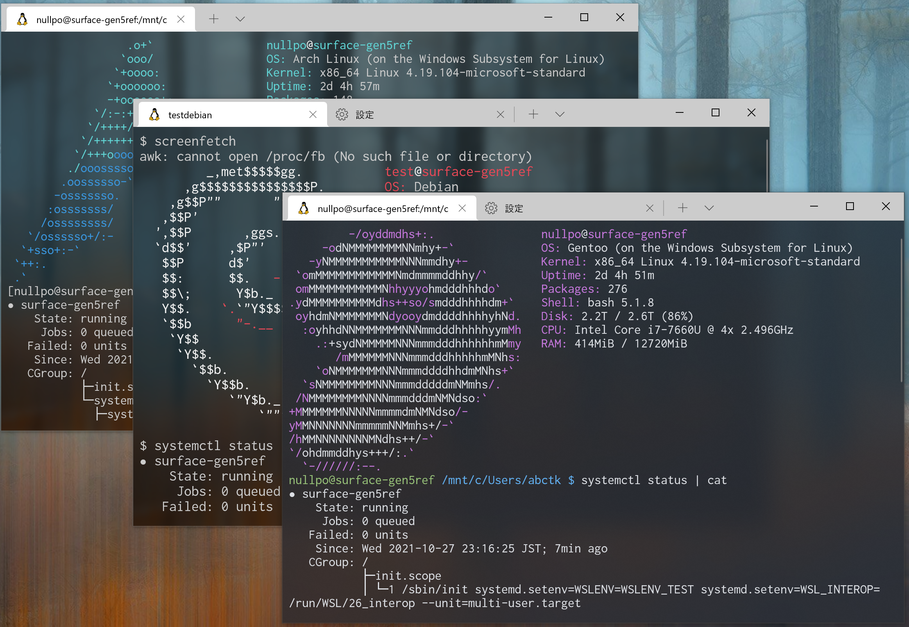
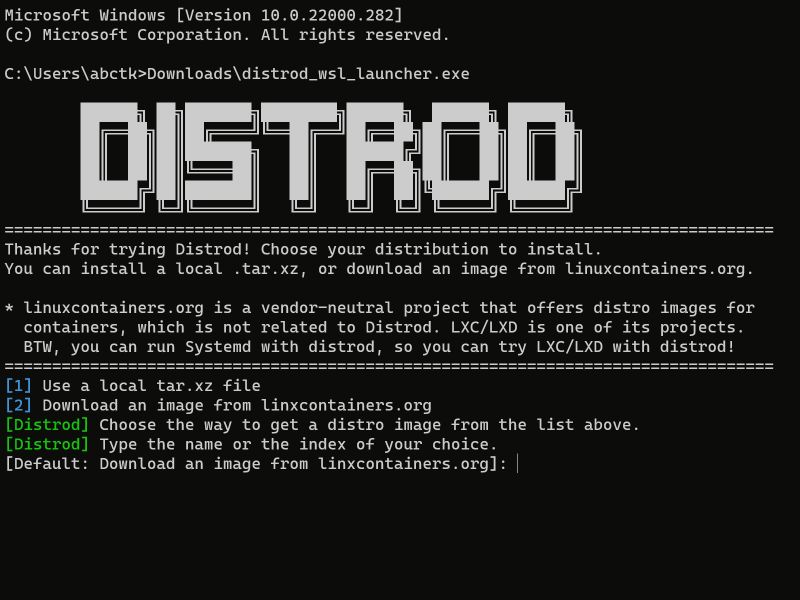

# Distrod - WSL2 Distros with Systemd!

[](https://github.com/nullpo-head/wsl-distrod/actions)

Distrod is a systemd-based meta-distro for WSL2 that allows you to install Ubuntu, Arch Linux, Gentoo and many other distros
with systemd in a minute, or make your current distro run systemd.

Distrod also provides built-in auto-start feature and port forwarding service.
This allows you to start systemd-managed services, such as `ssh`, on Windows startup and make it accessible from outside Windows.




With Distrod, you can

1. **Run systemd in WSL 2**  
   You can do the both of the following

   - Install a new distro with systemd running
   - Make your current WSL 2 distro run systemd

2. **Install any image available from [linuxcontainers.org](https://linuxcontainers.org) as a WSL 2 distro in 1 minute[^1].**

   - The following distros are continuously tested
     - Ubuntu, Debian, Arch Linux, Fedora, CentOS, AlmaLinux,
       Rocky Linux, Kali Linux, Linux Mint, openSUSE, Amazon Linux,
       Oracle Linux, Gentoo Linux  
       [](https://github.com/nullpo-head/wsl-distrod/actions) (See `Integration test on Linux (distro_name)`)
   - Other distros may or may not work

   \* [linuxcontainers.org](https://linuxcontainers.org) is a vendor-neutral project that offers distro images for
   containers, which is unrelated to Distrod. LXC/LXD is one of its projects.
   Systemd runs in the installed distro, so you can also try LXC/LXD in WSL!

3. **Start WSL on Windows Startup.**  
   This means that you can manage your ssh server and other services with systemd and start them automatically without any hassle!
   - Distrod also provides a port proxy service managed by systemd,
     allowing you to expose your Linux server to the outside world of Windows easily.

Feature under development

1. **Make your dual-booted physical Linux distro on a separate disk run as a WSL instance.**

[^1]: as long as your network connection is fast enough :)

## Install

### Option 1: Install a New Distro.

0. Make sure that your default WSL version is 2.

   ```console
   > wsl --set-default-version 2
   ```

1. Download and unzip [the latest `distrod_wsl_launcher-x86_64.zip` from release](https://github.com/nullpo-head/wsl-distrod/releases/latest/download/distrod_wsl_launcher-x86_64.zip), and double-click the extracted `.exe` file.

2. Follow the wizard to install a new distro.

3. Restart Distrod once to get it effective. (Workaround for missing necessary network initialization. Will be fixed soon)

   After closing the window,

   ```bat
   > wsl --terminate Distrod
   ```

4. \[Optional\] To make your distro start on Windows startup, run the following command.

   ```bash
   sudo /opt/distrod/bin/distrod enable --start-on-windows-boot
   ```

   You also might want to forward ports of services such as `ssh` to the outside of Windows.
   In that case, you can enable the built-in port proxy service provided by Distrod.

   **NOTE**: On Windows 11, exe files on WSL FS doesn't work on Windows startup. See [Known bus](docs/references.md#known-bugs).

   ```bash
   echo 22 | sudo tee /opt/distrod/conf/tcp4_ports  # update the portproxy.service's configuration
   sudo systemctl enable --now portproxy.service  # enable and start it
   ```

   For more detailed instruction, see [Forward Ports to outside of Windows](docs/references.md#forward-ports-to-outside-of-windows).

#### See also

- [Launch WSL 2 on Windows Startup](docs/references.md#launch-wsl-2-on-windows-startup)
- [Forward Ports to outside of Windows](docs/references.md#forward-ports-to-outside-of-windows)
- [Troubleshoot WSL Network Down](docs/references.md#troubleshoot-wsl-network-down)
- [Install and Run Multiple Distros at the same time](docs/references.md#install-and-run-multiple-distros-at-the-same-time)

### Option 2: Make your Current Distro Run Systemd

By this installation, systemd is enabled in your WSL 2 distro.

1. Download and run the latest installer script.

   ```bash
   curl -L -O "https://raw.githubusercontent.com/nullpo-head/wsl-distrod/main/install.sh"
   sudo ./install.sh install
   ```

   This script installs distrod, but doesn't enable it yet.

2. Enable distrod in your distro

   You have two options.
   If you want to automatically start your distro on Windows startup, enable distrod by the following command

   ```bash
   /opt/distrod/bin/distrod enable --start-on-windows-boot
   ```

   Otherwise,

   ```bash
   /opt/distrod/bin/distrod enable
   ```

   You can run `enable` with `--start-on-windows-boot` again if you want to enable autostart later.

3. Restart your distro

   Close your WSL's terminal.
   Open a new Command Prompt window, and run the following command.

   ```bat
   wsl --terminate Distrod
   ```

   After re-opening a new WSL window, your shell runs in a systemd session.

#### See also

- [Launch WSL 2 on Windows Startup](docs/references.md#launch-wsl-2-on-windows-startup)
- [Forward Ports to outside of Windows](docs/references.md#forward-ports-to-outside-of-windows)
- [Troubleshoot WSL Network Down](docs/references.md#troubleshoot-wsl-network-down)
- [Open a Shell Session outside the Container for Systemd](docs/references.md#open-a-shell-session-outside-the-container-for-systemd)
- [Disable Systemd / Distrod](docs/references.md#disable-systemd--distrod)

## Usage

If you are using [Windows Terminal](https://github.com/microsoft/terminal),
Windows Terminal will automatically find and register Distrod for you.
Just open the tab named "Distrod".

If you are using other terminals, please update your terminal settings to launch the Distrod.
For reference, the following command launches a distro by name in WSL

```console
> wsl --distribution Distrod
```

## How Distrod Works

In a nutshell, Distrod is a binary that creates a simple container that runs systemd as an init process,
and starts your WSL sessions within that container. To realize that, Distrod does the following things.

- Modify the rootfs of the concrete distro you chose so that it is compatible with both WSL and systemd.
  - Modify systemd services so that they are compatible with WSL
  - Configure networks for WSL
  - Put `/opt/distrod/bin/distrod` and other resources in the rootfs.
  - Register the Distrod's binary as the login shell
- When Distrod is launched by WSL's init as a login shell, Distrod
  1.  Starts systemd in a simple container
  2.  Launches your actual shell within that container
  3.  Bridges between the systemd sessions and the WSL interop environment.

## Other Notes

1. Does WSLg works on Distrod?

   Yes! Distrod doesn't prevent anything about WSLg. Distrod sets up sockets for X11 and environment variables properly.

   However, WSLg itself has some quirks even on non-Distrod WSL2 distros. Try many things until a GUI app runs.
   For example, to run `xeyes` without failure, I had to run it three times on the non-Distrod official Ubuntu 20.04.

### See also

- [References.md](docs/references.md)
- [Open a Shell Session outside the Container for Systemd](docs/references.md#open-a-shell-session-outside-the-container-for-systemd)
- [Disable Systemd / Distrod](docs/references.md#disable-systemd--distrod)
